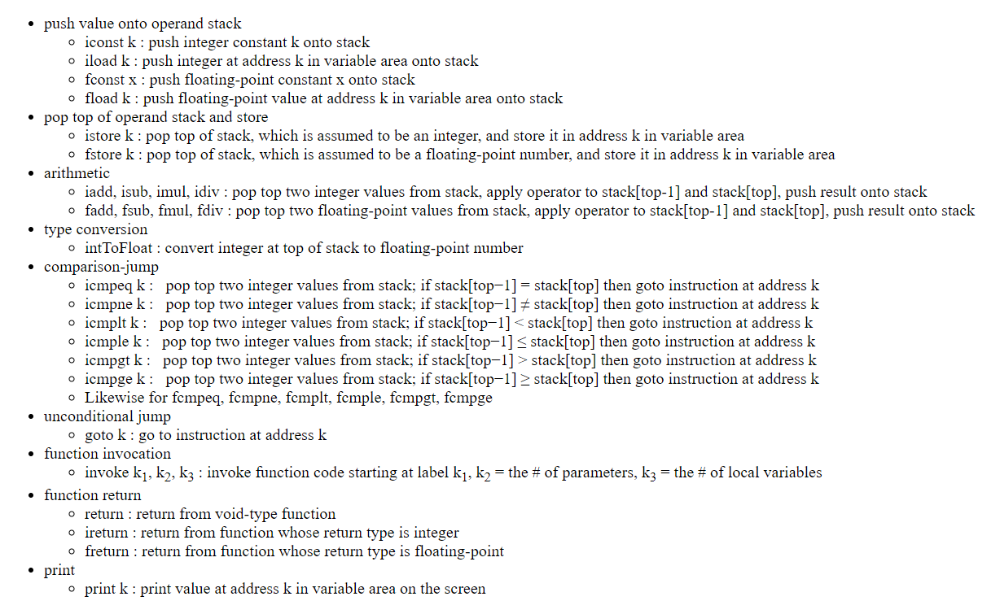

# VMstackMachine

**This project builds upon VMParser to implement a stack based virtual machine based on semantics for instructions.**        

---  

The objective of Project 3 is to build upon project 2, which purpose was to implement a top-down parser and an instruction store for our VM language.    

---   

Project 3 will contains a runtime Stack that holds Frame Objects. These contain an operand Stack and memory locations that will be used for processing the output given by  project 2 via a stack based virtual machine.    
 
---   

 Some parameters for the program implementation:   
 
1. Implementation for the signed/unsigned integers is 32-bit int type, floating-point numbers is double-precision 64-bit double type.      

2. Labels may be any non-negative integers and may occur in any order in the instruction list.       
       They must, however, obey the following "semantic rules":      
	       a. No label may occur more than once in an instruction list.      
           b. The target label of each comparison-jump, goto, and invoke instruction must occur in the instruction list.    
           c. If these rules are violated, your program issues appropriate error messages.     

3. The labels used in the instruction list, including the target labels in comparison-jump, goto, and invoke instructions, are mapped to the corresponding indexes of the instruction array.     

---   

Below are extra details for the semantics:    

   

---

**Running the program**   

This program requires input as command line arguments in order to run properly:     
   
  argv[0] - must be a valid file name with input to be lexically analyzed, parsed and executed      
  argv[1] - a valid file name for the parsed output to be written to     
  argv[2] - OPTIONAL: a file with expected parsing output to be compared to generated output for details, check the Javadocs for comapareOutput() in Stream.java    
  
  ---

